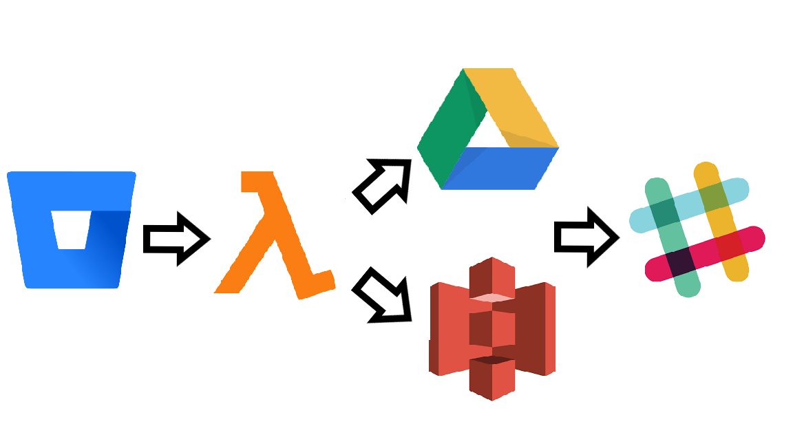

# Lambda evidences

This repository contains the necessary code to:

1. Connect to Bitbucket via API
2. For each repository, download it's code evidences and store them in a set of .txt files, each one containing the evidences of one person (from a given list of people)
3. Obtain a set of zip files, each one containing all repositories evidences for each person in the list
4. Upload these zip files to S3 via Access Keys.
5. Upload these zip files to Google Drive via API.
6. Send a Slack message with the results of the process.

(and the necessary libraries to do this).



All these steps are done in the script `lambda_ev.py`. The purpose of this script is to be launched every first day of the month, generate the code evidences of the past month and upload them to different storage services, so then workers can upload them to BaseTIS ERP.

It is important to say that the script contains a list of repositories on which to look for evidences (REPS), a list of people for whom to upload evidences (EMAILS), a name of the S3 bucket on which evidences will be uploaded (BUCKET_NAME), the uri where you want them to be uploaded in the bucket (BUCKET_URI), and the ID of the folder in Google Drive where you want evidences to be uploaded (FOLDER_ID). You have to add all these constants to `lambda_ev.py`.

In this readme, I will explain in detail how each one of these steps is done, and how to deploy this code to an AWS Lambda. If you have cloned the repository and are not interested in the implementation, just in getting the evidences, you can "skip" the explanations. You still have to read them because they explain how to get the necessary tokens to get and upload the evidences. Once you have the tokens, you have to update `lambda_ev.py` with your constants (see previous paragraph), and go directly to read **Deploying in AWS Lambda** (at the bottom of the README).

## 1. Connect to Bitbucket via API

To connect to Bitbucket, we need an Access Key Id and an Access Secret Key. We can get them following these steps:

1. Go to https://bitbucket.org/account/user/{your_username_here}/api
2. In OAuth Consumers, click **Add consumer**
3. Insert a name, for example "SMA Evidences"
4. In Callback URL, insert any URL (for OAuth 2, it is needed, but we don't use it), for example https://basetis.com
5. Give permission to read repositories and pull requests
6. Save
7. In OAuth Consumers, click on the name that you gave to the consumer, and it will appear your Key and Secret
8. Store them as environment variables with names `BITBUCKET_KEY_ID` and `BITBUCKET_SECRET_KEY`, respectively
9. Install Python `requests` library, in order to do Python requests

Now that we have our keys, to get data from bitbucket we have to get a temporal token. This is done doing a post request:

```python
data = {'grant_type': 'client_credentials'}

response = requests.post(
    'https://bitbucket.org/site/oauth2/access_token',
    auth=(os.environ['BITBUCKET_KEY_ID'], os.environ['BITBUCKET_SECRET_KEY']),
    data=data
)

token = json.loads(response.text)['access_token']
```

> In our code, this is done in the function `get_bitbucket_token`.

## 2. For each repository, download it's code evidences and store them in a set of .txt files, each one containing the evidences of one person (from a given list of people)
Now that we have our token, for every repository we can do a get request to the following url:

https://bitbucket.org/api/2.0/repositories/{owner_name}/{repository_name}/commits/

This will return us a JSON with information about the last 30 commits, and a url to do the next get request. Then, we add the info to a dictionary, and do a get request to the url that we got. This will again give us a JSON with information about the last 31 to 60 commits, and a url to do the next get request. We can recursively do this until we get commits that we don't want (because they were done in another month).

We will end up with a dictionary with the info of all the commits of the past month.

> In our code, this is done in the function `get_evidences`

Now we create a dictionary where we will store a list of each person's commits: for each commit, we look at its author, and append the commit info to the author's list in the dictionary. If the commit is a pull request, we will also append the commit info to each approver's list.

> In our code, this is done in the function `evidences_by_person`

Then, we create a .txt file for each person, containing the evidences of the given person.

> In our code, this is done in the function `create_evidences`

## 3. Obtain a set of zip files, each one containing all repositories evidences for each person in the list
Once we have done step 2 for every repository, we will end up with a set of .txt files.

Then, for each person we create a .zip file containing all the .txt's of the person evidences. 

> In our code, this is done in the function `create_zips`

## 4. Upload these zip files to S3 via Access Keys.
Now that we have our zip files, we have to upload them to some cloud storage service so we can access them, because we can't access Lambda's local storage.

At first, we upload them to a bucket that we have on AWS S3.

To start, we need some things:

* A bucket in S3
* A user with access to this bucket
* User's Access Key ID
* User's Secret Access Key

If you need any of these, you can ask Systems (systems.support@basetis.com) for them.

Now that we have this, we store the keys as environment variables named S3_KEY_ID and S3_SECRET_KEY.

To connect to S3, we first need an S3 client. We can get one with the Python library `boto3`:

```python
s3_client = boto3.client(
    's3',
    aws_access_key_id=os.environ['S3_KEY_ID'],
    aws_secret_access_key=os.environ['S3_SECRET_KEY']
)
```

> In our code, this is done in the function `get_s3_client`

Now, we upload each .zip to a subfolder in a bucket that we have in S3:

```python
s3_client = get_s3_client()

for person in PEOPLE:
    s3_client.upload_file(
        FILE_IN_LOCAL, # This is the file in our Lambda local storage
        BUCKET_NAME, # This is our bucket name
        BUCKET_URI.format(person, date=mdate) # This is the place where we want to place the file in S3
    )
```

> In our code, this is done in the function `upload_to_s3`

## 5. Upload these zip files to Google Drive via API
Now that we have uploaded the files to S3, we upload them to Google Drive via API.

The idea is to have a folder called **Imputació d'hores**, in this folder have subfolders of the format **YYYY_MM**, and in this subfolders have the zips of the given month.

To do this, we need three things:

* A user with access to the folder where we want to upload the files
* User's Google Drive Access Key ID
* User's Google Drive Secret Access Key
* User's Google Drive Refresh Token

To get the keys and the token, you can follow this tutorial: https://help.talend.com/reader/Ovc10QFckCdvYbzxTECexA/EoAKa_oFqZFXH0aE0wNbHQ

Now that we have the keys and the token, we store them as environment variables called GOOGLE_KEY_ID, GOOGLE_SECRET_KEY and GOOGLE_REFRESH_TOKEN.

Now it's time to code.

First, we have to get a temporal access token: this is done with a post request to https://accounts.google.com/o/oauth2/token:

```python
data = {
    'grant_type': 'refresh_token',
    'client_id': os.environ['GOOGLE_KEY_ID'],
    'client_secret': os.environ['GOOGLE_SECRET_KEY'],
    'refresh_token': os.environ['GOOGLE_REFRESH_TOKEN']
}

response = requests.post(
    'https://accounts.google.com/o/oauth2/token',
    data=data,
)

token = json.loads(response.text)['access_token']
```

> In our code, this is done in the function `get_drive_token`

It is possible that evidences of the past month have already been generated, but we want to rerun the script because there were missing repositories, for example.

Because of this, we have to delete any subfolder of the past month in the folder where evidences are uploaded.

We can do this in two steps:

1. We do a get request to https://www.googleapis.com/drive/v2/files?q=title='{YYYY_MM}' to get a list of all the folder's that have as name the past month
2. For each of these folders, if its parent is the folder where evidences are uploaded, we do a delete request to https://www.googleapis.com/drive/v2/files/{YYYY_MM} to delete it.

```python
folder_name = "{:%Y_%m}".format(mdate) # mdate is any datetime object in the past month

url = "https://www.googleapis.com/drive/v2/files?q=title='{}'"
headers = {"Authorization": "Bearer {}".format(token)}
response = requests.get(url.format(folder_name), headers=headers)

for folder in json.loads(response.text)['items']:
    folder_id = folder['id']

    for parent in folder['parents']:
        if parent['id'] == FOLDER_ID: # The ID of the folder where we upload evidences
            requests.delete(
                'https://www.googleapis.com/drive/v2/files/{}'.format(folder_id),
                headers=headers
            )
```

> In our code, this is done in the function `delete_previous_folders`

Now, we create a new folder that will have as name the past month:

```python
headers = {"Authorization": "Bearer {}".format(token)}
params = {
    "name": "{:%Y_%m}".format(mdate), # mdate is any datetime object in the past month
    'mimeType': 'application/vnd.google-apps.folder',
    "parents": [FOLDER_ID], # The ID of the folder where we upload evidences
}
files = {
    'data': ('metadata', json.dumps(params), 'application/json; charset=UTF-8'),
}

response = requests.post(
    "https://www.googleapis.com/upload/drive/v3/files?uploadType=multipart",
    headers=headers,
    files=files
)

folder_id json.loads(response.text)['id']
```

> In our code, this is done in the function `create_drive_folder`

Finally, we upload every person zip's, by doing a post request to https://www.googleapis.com/upload/drive/v3/files?uploadType=multipart:

```python
headers = {"Authorization": "Bearer {}".format(token)}

for person in PEOPLE:
    para = {
        "name": FILE_NAME, # Name we want the file to have in Google Drive
        "parents": [folder_id] # ID of the folder we just created (we get it in the previous step)
    }
    files = {
        'data': ('metadata', json.dumps(para), 'application/json; charset=UTF-8'),
        'file': open(FILE_LOCAL, "rb") # FILE_LOCAL is the name of the file in Lambda's local storage
    }

    requests.post(
        "https://www.googleapis.com/upload/drive/v3/files?uploadType=multipart",
        headers=headers,
        files=files
    )
```

> In our code, this is done in the function `upload_drive_zips`

## 6. Send a Slack message with the results of the process
Finally, we send a Slack message with the results of the process.

We need the following:

1. A Slack App in the workspace we want to send the message
2. A bot in this app
3. The bot's token

Once we have the token, we store it as an environment variable called BOT_TOKEN.

To send Slack messages, we will be using a Python library called `slackclient`.

Once we have imported `SlackClient` from it, we create a client:

```python
token = os.environ.get('BOT_TOKEN')

slack_client = SlackClient(token)
```

Now, we can send a message:
```python
all_reps_found = not bool(reps_not_found) # reps_not_found is a list that contains the repositories in the program's list that were not found when connecting to Bitbucket
all_emails_in_all_reps = not bool(not_found_emails_in_all_reps) # not_found_emails_in_all_reps is a list that contains all the people that did at least one commit and were not found in the program's list of people

text = SLACK_MESSAGES[all_reps_found][all_emails_in_all_reps] # Gets the message that has to be sent, in relation to all_reps_found and all_emails_in_all_reps

channel = "#events" if all_reps_found else "#urgent" # Gets the channel to which the message has to be sent

slack_client.api_call(
    "chat.postMessage",
    channel=channel,
    text=text.format(mdate=mdate, reps=reps_not_found, emails=not_found_emails_in_all_reps),
    username="Username",
    icon_emoji=":Emoji:"
) # Sends the message
```

# Deploying in AWS Lambda
Once we have the script done, it's time to deploy it to an AWS Lambda!

**If you have cloned the repository, you can skip this part**

First, we need to add a `lambda_handler` to our script. It's the function that will be called when the lambda is launched.

In our case, our `lambda_handler` is:

```python
def lambda_handler(event, context):
    """
        Function that is called when the lambda is triggered
    """

    main()
    return True
```

Now, we have to create the zip that will be uploaded to AWS. The zip will contain the source code (in this case, `lambda_ev.py`) and all the libraries that we use and are not installed in the Lambda. In this case, these libraries are `requests` and `slackclient` (you can see that they are in `requirements.txt`).

To get these libraries, we open a new terminal, navigate to our working folder, and run the following command:

```bash
pip install -r requirements.txt -t ./
```

**If you have cloned the repository, you can start reading here**

To deploy all this to AWS Lambda, we first select all the files in the folder except `README.md` and `requirements.txt` and compress them in a zip file.

If you don't have access to AWS, ask to Systems (systems.support@basetis.com) for access to AWS and permissions to create Lambdas.

Now, we go to AWS and create a new Lambda. To do this, we first go to the AWS Lambda webpage, we click on **Create function**, we give it a name, select Python 3.6 as runtime, and select a role.

Once we have created the Lambda, we go to **Function code**, select **Upload a .ZIP file** and upload our zip. Then, in **Handler**, we put the name of our handler and the script where it is located. In our case, it would be `lambda_ev.lambda_handler`. Now, you have to add all the tokens that you got in previous steps as environment variables, called:

* BITBUCKET_KEY_ID
* BITBUCKET_SECRET_KEY
* BOT_TOKEN
* GOOGLE_KEY_ID
* GOOGLE_REFRESH_TOKEN
* GOOGLE_SECRET_KEY
* S3_KEY_ID
* S3_SECRET_KEY

Finally, we add a trigger to our function. In the **Designer** interface, we select **CloudWatch Events** from **Add triggers**. In **Configure trigger**, we select **Create a new rule**, give it a name and a description, select **Schedule expression** and write `cron(0 4 1 * ? *)`. Now we can save the trigger. This trigger is a cron expression that will trigger our lambda every first day of the month at 6:00.